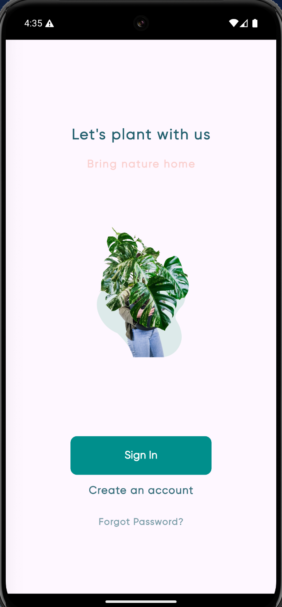
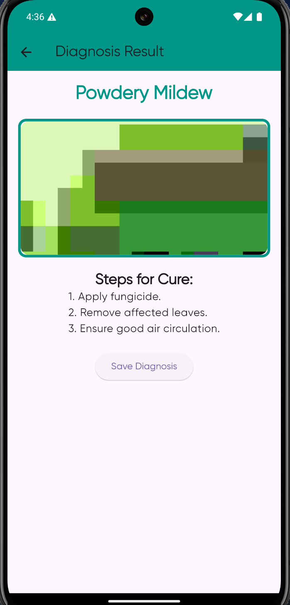

# Kissan Konnect

Kissan Konnect is a Flutter application designed to assist users with plant disease diagnosis. It provides features like plant disease detection using the camera, weather updates, plant information, and a community section to stay informed about agricultural news.

## Features

- **Plant Disease Diagnosis**: Use the camera to capture images of plants and receive diagnosis results.
- **Weather Information**: View current weather conditions and forecasts.
- **Community News**: Stay updated with the latest news related to agriculture.
- **Profile Management**: Manage user profile and access historical diagnosis data.
- **Camera Functionality**: Take pictures for diagnosis and upload images from the device.

## Screenshots






## Getting Started

### Prerequisites

Ensure you have the following installed:
- [Flutter](https://flutter.dev/docs/get-started/install)
- [Dart](https://dart.dev/get-dart)
- [Firebase](https://firebase.google.com/docs/flutter/setup) (for authentication and other services)

### Setup

1. **Clone the Repository**

   ```bash
   git clone https://github.com/Orcus01/Kissan_Konnect.git
   cd Kissan_Konnect
   
2. **Install Dependencies**
   Next, install the required dependencies by running the following command in the project directory:
   ```bash
   flutter pub get
   
4. **Configure Firebase**
   Follow these steps to set up Firebase for both Android and iOS:
   
   i. Add the google-services.json file to the android/app directory.
   
   ii. Add the GoogleService-Info.plist file to the ios/Runner directory.
   
6. **Run the App**
   To run the app on a connected device or emulator, execute:
   
   ```bash
   flutter run

